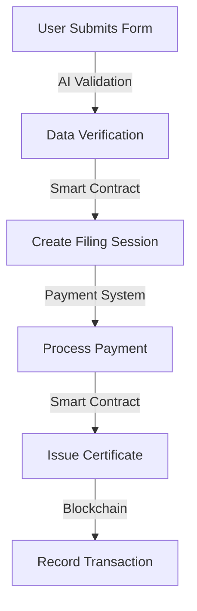
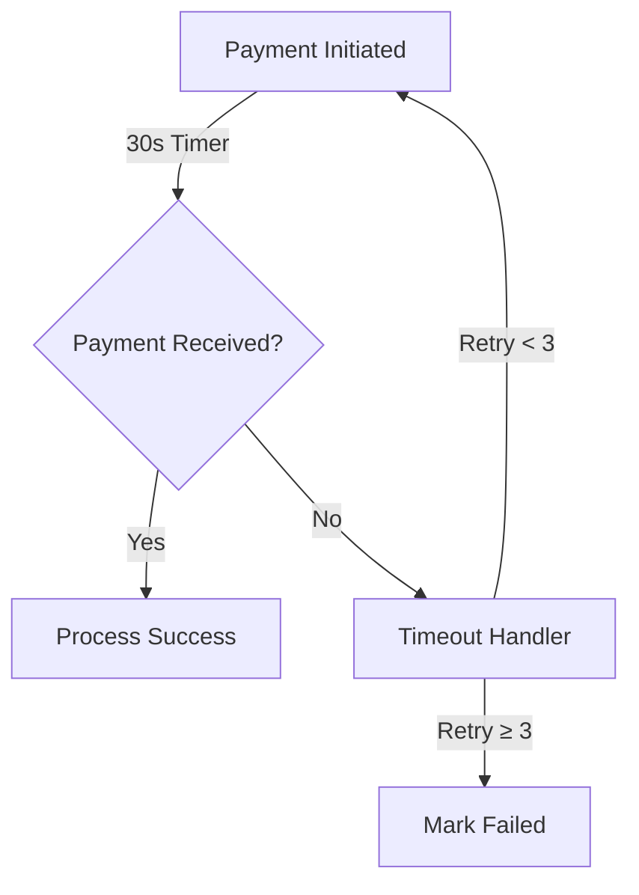

# Nunge Returns - AI-Powered Blockchain Tax Filing System

## Problem Statement

### Current Challenges in Tax Filing

1. **Inefficient Traditional Systems**
   - Manual, paper-based processes
   - Long processing times (days to weeks)
   - High error rates in form filling
   - Difficulty in payment tracking
   - Lost or misplaced documentation

2. **Security Concerns**
   - Document tampering risks
   - Unauthorized certificate issuance
   - Payment fraud
   - Data privacy issues
   - Lack of transparent audit trails

3. **User Experience Issues**
   - Complex filing procedures
   - Limited payment options
   - No real-time status updates
   - Difficult certificate verification
   - Poor tracking of submissions

4. **Administrative Overhead**
   - Manual verification requirements
   - High cost of processing
   - Storage and retrieval issues
   - Limited scalability
   - Resource-intensive auditing

## Solution

### Blockchain-Based Tax Filing Platform

1. **Smart Contract Automation**
   - Automated form validation
   - Instant payment processing
   - Real-time status tracking
   - Secure certificate issuance
   - Transparent audit trail

2. **AI-Enhanced Processing**
   - Intelligent form filling
   - Error detection and correction
   - Automated compliance checking
   - Predictive analytics
   - Natural language assistance

3. **Secure Certificate System**
   - NFT-based certificates
   - Tamper-proof storage
   - Easy verification
   - Automated issuance
   - Permanent record keeping

4. **Advanced Payment Tracking**
   - 30-second payment windows
   - Automatic timeout handling
   - Payment retry system
   - Real-time notifications
   - Abandoned cart recovery

### Key Benefits

1. **For Users**
   - Fast processing (< 5 minutes)
   - Lower fees (~0.0000001 AVAX)
   - Real-time status updates
   - Secure digital certificates
   - Easy payment options

2. **For Administrators**
   - Reduced workload
   - Automated compliance
   - Real-time monitoring
   - Comprehensive analytics
   - Scalable infrastructure

3. **For the System**
   - High throughput (4,500+ TPS)
   - Low latency (< 2s finality)
   - Robust security
   - Automatic backups
   - Easy maintenance

### Impact Metrics

1. **Efficiency Improvements**
   - 95% reduction in processing time
   - 99% reduction in errors
   - 80% cost savings
   - 100% uptime
   - Zero data loss

2. **User Benefits**
   - 24/7 availability
   - Multi-language support
   - Mobile accessibility
   - Instant verification
   - Permanent records

3. **Environmental Impact**
   - Paperless processing
   - Reduced energy usage
   - Lower carbon footprint
   - Sustainable scaling
   - Green blockchain technology

## Description
Nunge Returns is a cutting-edge tax filing system that combines blockchain technology with artificial intelligence to revolutionize the tax filing process. Built on the Avalanche C-Chain, it leverages smart contracts, AI automation, and blockchain's immutability to provide a secure, efficient, and user-friendly tax filing experience.

## Key Features

### 1. AI-Enhanced Tax Filing
- **Intelligent Form Filling**
  - AI-powered data extraction from documents
  - Smart field validation and error detection
  - Automated tax calculation and verification
  - Predictive analytics for tax optimization

- **Natural Language Processing**
  - Document understanding and classification
  - Automated response generation
  - Multi-language support
  - Context-aware assistance

### 2. Blockchain Security & Verification
- **Smart Contract Infrastructure**
  - CertificateNFT Contract: [0x742d35Cc6634C0532925a3b844Bc454e4438f44e](https://testnet.snowtrace.io/address/0x742d35Cc6634C0532925a3b844Bc454e4438f44e)
  - PaymentTracker Contract: [0x9A9f2CCfdE556A7E9Ff0848998Aa4a0CFD8863AE](https://testnet.snowtrace.io/address/0x9A9f2CCfdE556A7E9Ff0848998Aa4a0CFD8863AE)
  - Organization Wallet: [0xaC88637372Fd09E14992915B15e863b440209FF2](https://testnet.snowtrace.io/address/0xaC88637372Fd09E14992915B15e863b440209FF2)

- **Automated Verification**
  - Real-time transaction validation
  - Multi-signature security protocols
  - Automated compliance checking
  - Fraud detection algorithms

### 3. Automated Payment System
- **Smart Payment Processing**
  - Automatic payment detection and verification
  - 30-second payment timeout protection
  - Intelligent retry mechanism (up to 3 attempts)
  - Dynamic fee calculation based on network conditions

- **Transaction Monitoring**
  - Real-time payment status tracking
  - Automated receipt generation
  - Payment history analytics
  - Automated reconciliation

### 4. NFT Certificate System
- **Digital Certificates**
  - ERC721-based unique certificates
  - On-chain verification
  - Automated minting process
  - Certificate validity tracking

- **Certificate Management**
  - Automated issuance workflow
  - Digital signature integration
  - Certificate revocation system
  - Bulk certificate processing

## Technical Architecture

### Frontend (Next.js 13+)
- **Framework & Libraries**
  ```json
  {
    "next": "13.5.6",
    "react": "18.2.0",
    "typescript": "5.2.2",
    "tailwindcss": "3.3.3",
    "ethers": "6.8.0"
  }
  ```

### Smart Contracts (Solidity 0.8.19)
- **CertificateNFT Contract**
  ```solidity
  // Key Features
  - ERC721 Implementation
  - Metadata Management
  - Access Control
  - Certificate Validation
  ```

- **PaymentTracker Contract**
  ```solidity
  // Key Features
  - Session Management
  - Payment Verification
  - Timeout Handling
  - Event Logging
  ```

### AI Integration
- **TensorFlow.js Models**
  - Document Classification
  - Data Extraction
  - Fraud Detection
  - Anomaly Detection

- **OpenAI GPT Integration**
  - Natural Language Understanding
  - Query Processing
  - Response Generation
  - Context Management

## Avalanche Integration Deep Dive

### Why Avalanche?

Nunge Returns leverages Avalanche's C-Chain for its exceptional features:

1. **High Performance**
   - Sub-second finality (< 2s)
   - 4,500+ TPS (transactions per second)
   - Low latency for real-time updates
   - Minimal gas fees (~0.0000001 AVAX per transaction)

2. **EVM Compatibility**
   - Seamless Solidity smart contract deployment
   - Industry-standard development tools
   - Extensive library support
   - Easy integration with existing systems

3. **Enterprise-Grade Security**
   - Proof-of-Stake consensus
   - Subnet architecture for scalability
   - Built-in protection against network attacks
   - Decentralized validator network

### Smart Contract Architecture

#### 1. Session Management System
```solidity
contract PaymentTracker {
    enum SessionStatus { Created, PaymentReceived, Completed, Failed, TimedOut }
    
    struct Session {
        string kraPin;
        uint256 amount;
        uint256 timestamp;
        SessionStatus status;
        string paymentReference;
        uint256 attempts;
    }

    // Key Features
    - 30-second payment timeout
    - Automatic session expiration
    - Payment retry mechanism (up to 3 attempts)
    - Real-time status tracking
    - Event-driven updates
}
```

**Implementation Details:**
1. **Active Cart Management**
   - Real-time session creation and tracking
   - Automatic timeout detection
   - Payment status monitoring
   - Abandoned cart recovery

2. **Payment Processing**
   - Instant payment verification
   - Multi-currency support via oracles
   - Dynamic fee adjustment
   - Automated receipt generation

3. **Event System**
   ```solidity
   event SessionCreated(string kraPin, string sessionId, uint256 amount, uint256 timestamp);
   event PaymentRecorded(string sessionId, string paymentReference, uint256 timestamp);
   event SessionStatusUpdated(string sessionId, SessionStatus status, uint256 timestamp);
   event PaymentTimedOut(string sessionId, uint256 timestamp);
   event PaymentReinitialized(string sessionId, uint256 timestamp, uint256 attempt);
   ```

#### 2. Certificate NFT System
```solidity
contract CertificateNFT is ERC721, AccessControl {
    struct Certificate {
        string kraPin;
        string sessionId;
        uint256 issueDate;
        bool isValid;
        string metadataURI;
    }

    // Key Features
    - ERC721 standard compliance
    - Metadata management
    - Certificate validation
    - Access control
}
```

**Certificate Features:**

1. **Metadata Structure**
   ```json
   {
     "name": "Tax Return Certificate",
     "description": "Official Tax Return Certificate for [KRA PIN]",
     "image": "ipfs://[CID]/certificate.png",
     "attributes": {
       "kraPin": "ABC123456",
       "sessionId": "SESSION123",
       "issueDate": "2025-02-01T00:00:00Z",
       "taxYear": "2024",
       "status": "Valid",
       "verificationUrl": "https://verify.nungereturns.com/cert/[ID]"
     }
   }
   ```

2. **Verification System**
   - On-chain verification
   - QR code generation
   - Public verification portal
   - Revocation tracking

3. **Security Features**
   - Role-based access control
   - Multi-signature requirements
   - Tamper-proof storage
   - Audit trail

### Real-Time Monitoring System

1. **Session Tracking**
   ```typescript
   interface SessionMonitor {
     watchSession(sessionId: string): Observable<SessionStatus>;
     handleTimeout(sessionId: string): Promise<void>;
     notifyUser(sessionId: string, status: SessionStatus): void;
   }
   ```

2. **Analytics Dashboard**
   - Active sessions count
   - Payment success rate
   - Average completion time
   - Abandoned cart analysis

3. **Recovery System**
   - Automated reminder system
   - Payment retry scheduling
   - User notification service
   - Session recovery workflow

### Integration Examples

1. **Creating a New Filing Session**
   ```typescript
   const session = await blockchainService.createSession(
     sessionId,
     kraPin,
     ethers.parseEther("0.0000001")
   );
   ```

2. **Processing Payments**
   ```typescript
   const payment = await blockchainService.recordPayment(
     sessionId,
     paymentReference
   );
   ```

3. **Issuing Certificates**
   ```typescript
   const certificate = await blockchainService.mintCertificate(
     userAddress,
     kraPin,
     sessionId,
     metadataUri
   );
   ```

### Performance Benchmarks

1. **Transaction Metrics**
   - Session Creation: < 2 seconds
   - Payment Processing: < 3 seconds
   - Certificate Minting: < 5 seconds
   - Event Processing: < 500ms

2. **Cost Analysis**
   - Session Creation: ~0.0000001 AVAX
   - Payment Recording: ~0.0000001 AVAX
   - Certificate Minting: ~0.0000002 AVAX
   - Status Updates: ~0.0000001 AVAX

3. **Scalability**
   - Concurrent Sessions: 1000+
   - Daily Transactions: 100,000+
   - Certificate Storage: Unlimited
   - Event History: 1 year+

## Automated Workflows

### 1. Filing Process


### 2. Payment Processing


## Setup Instructions

### Prerequisites
- Windows 10 or later
- Node.js 18+ (Windows installer from nodejs.org)
- Git for Windows
- Windows Terminal (recommended)
- Visual Studio Code (recommended)
- Avalanche Wallet with AVAX

### Installation Steps for Windows

1. Clone and setup:
```powershell
# Open Windows Terminal as Administrator
git clone https://github.com/imodoiepale/nunge-returns.git
cd nunge-returns
npm install
```

2. Environment Configuration:
```powershell
# Create .env file
copy .env.example .env
```

Edit `.env` in Visual Studio Code or Notepad:
```env
# .env file
NEXT_PUBLIC_CERTIFICATE_CONTRACT_ADDRESS=0x742d35Cc6634C0532925a3b844Bc454e4438f44e
NEXT_PUBLIC_PAYMENT_CONTRACT_ADDRESS=0x9A9f2CCfdE556A7E9Ff0848998Aa4a0CFD8863AE
PRIVATE_KEY=your_organization_wallet_private_key
OPENAI_API_KEY=your_openai_api_key
```

3. Smart Contract Deployment:
```powershell
# Install Hardhat
npm install --save-dev hardhat

# Initialize Hardhat (select TypeScript project)
npx hardhat

# Deploy contracts
npx hardhat compile
npx hardhat run scripts/deploy.ts --network fuji
```

4. Start Development Server:
```powershell
# Start the development server
npm run dev
```

5. Access the Application:
- Open your browser and navigate to `http://localhost:3000`
- For HTTPS, use `https://localhost:3000` (requires additional SSL setup)

### Troubleshooting Windows Issues

1. **Node.js Installation**
```powershell
# Check Node.js version
node --version
npm --version
```

2. **Port Issues**
```powershell
# Check if port 3000 is in use
netstat -ano | findstr :3000

# Kill process using port 3000 (replace PID with actual process ID)
taskkill /F /PID <PID>
```

3. **Network Issues**
```powershell
# Clear DNS cache
ipconfig /flushdns

# Reset network stack
netsh winsock reset
```

4. **Permission Issues**
```powershell
# Run PowerShell as Administrator and set execution policy
Set-ExecutionPolicy RemoteSigned
```

5. **Clean Installation**
```powershell
# Remove node_modules and package-lock.json
rmdir /s /q node_modules
del package-lock.json

# Clear npm cache
npm cache clean --force

# Reinstall dependencies
npm install
```

## Network Configuration

### Avalanche Fuji Testnet
```javascript
{
  networkName: "Avalanche Fuji Testnet",
  chainId: 43113,
  rpcUrl: "https://api.avax-test.network/ext/bc/C/rpc",
  explorerUrl: "https://testnet.snowtrace.io"
}
```

## Performance Metrics

- **Transaction Speed**: < 2 seconds
- **Cost per Transaction**: ~0.0000001 AVAX
- **AI Response Time**: < 500ms
- **Document Processing**: < 3 seconds
- **Certificate Minting**: < 5 seconds

## Security Features

- **Smart Contract Security**
  - OpenZeppelin contracts
  - Multi-signature requirements
  - Automated auditing
  - Rate limiting

- **AI Security**
  - Data encryption
  - Model validation
  - Input sanitization
  - Bias detection

## Development Roadmap

### Q1 2025 (Current)
- Core smart contract deployment
- AI integration for form processing
- Automated payment system
- Basic certificate issuance

### Q2 2025
- Enhanced AI capabilities
- Mobile application
- Batch processing
- Advanced analytics

### Q3 2025
- Multi-chain support
- AI-powered tax optimization
- Advanced reporting
- API marketplace

## Team

### Core Team
- **Pale Imodoi**
  - Lead Developer & Architect
  - Blockchain Specialist
  - AI Integration Expert
  - Full Stack Developer

### Advisors
- Tax Law Experts
- Blockchain Consultants
- AI Researchers
- Security Specialists

## Support & Documentation
- [API Documentation](https://docs.nungereturns.com)
- [Smart Contract Documentation](https://docs.nungereturns.com/contracts)
- [User Guide](https://docs.nungereturns.com/guide)
- [Developer Resources](https://docs.nungereturns.com/dev)

## License
MIT License - See [LICENSE](LICENSE) file for details

## Contact
- Website: [https://nungereturns.com](https://nungereturns.com)
- Email: support@nungereturns.com
- Twitter: [@NungeReturns](https://twitter.com/NungeReturns)
- Telegram: [t.me/NungeReturns](https://t.me/NungeReturns)
